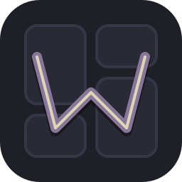
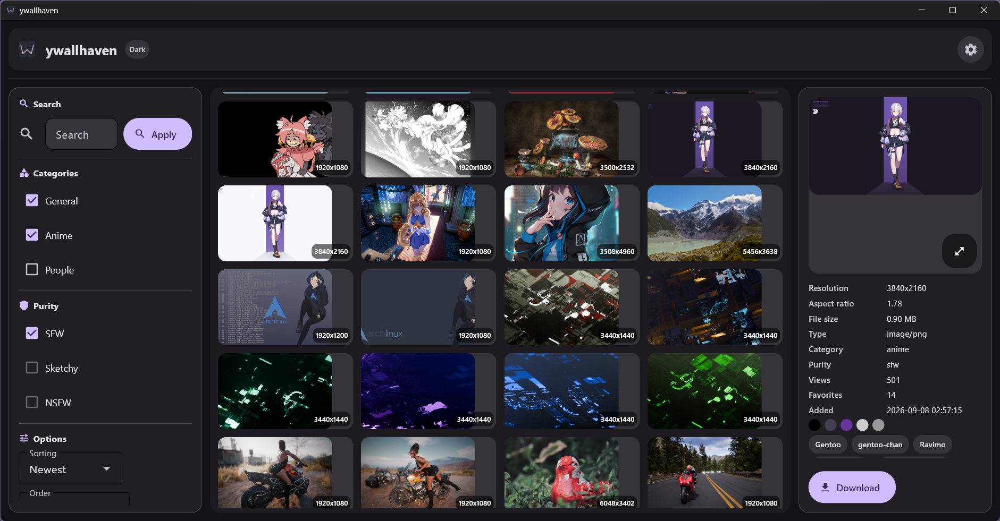
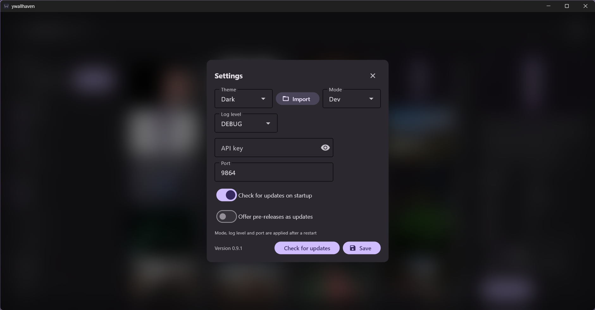
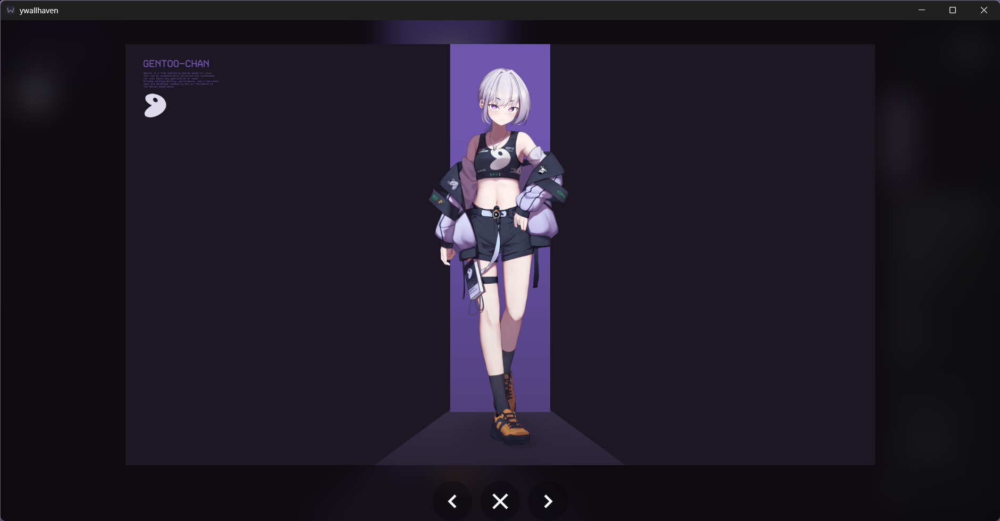
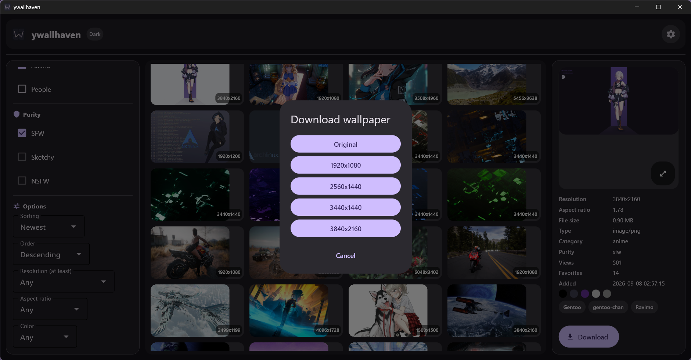

# 🖼 ywallhaven

🌐 Язык / Language **README**: **Русский** · [English](README.en.md)



> **Краткое описание:** 🖼️🔍 Десктопное GUI-приложение для поиска, просмотра и скачивания обоев с [Wallhaven](https://wallhaven.cc/). Построено на асинхронном стеке Python и [Flet](https://flet.dev/) - без браузера и лишнего интерфейса, только нативное окно.

## ❔ Зачем вообще проект?

Личный клиент для Wallhaven: искать, фильтровать и скачивать обои сразу из отдельного приложения, без открытия сайта в браузере.

## 🛠 Техно-стек

- **Язык:** `Python 3.13`
- **GUI-фреймворк:** `Flet`
- **HTTP-клиент:** `httpx` (async)
- **Валидация/конфигурация:** `Pydantic` + `pydantic-settings`
- **Пакетный менеджер:** `uv` (`hatchling` под капотом)
- **Сборка в exe:** `PyInstaller` (Windows)
- **Источник данных:** [Wallhaven API](https://wallhaven.cc/help/api)

## Предпоказ/галерея

Увидеть полную галерею тем: [SHOWING THEMES](docs/SHOWING%20THEMES.md). Тут представлена тема: `dark_default`:






## 💜 Руководство пользователя

### 🔽 Установка / Быстрый старт

По плану:
1. Зайдите на страничку релизов: [Releases](https://github.com/Sh1yden/ywallhaven/releases).
2. Скачайте `ywallhaven_portable-vX.Y.Z.zip` (там внутри папка `ywallhaven` с обоими `exe`). Хотите пофайлово — берите `ywallhaven.exe` + `ywallhaven-updater.exe` отдельно.
3. По желанию проверьте целостность (сверьте хеш с `SHA256SUMS.txt` из того же релиза):

```shell
certutil -hashfile ywallhaven.exe SHA256
```

4. Распакуйте в любое удобное место и запустите `ywallhaven.exe` 💜.

При первом запуске рядом с exe сами создадутся `config.json` (настройки по умолчанию, см. [`config.example.json`](config.example.json)), папка `logs` (логи) и папка `themes` (свои темы + гайд с примерами внутри).

### 🖱 Повседневное пользование

- **Поиск:** вбейте запрос слева, настройте фильтры (категории, `purity`, сортировка, разрешение) и жмите поиск. По тегу можно искать кликом прямо по тегу под превью — запрос подставится сам.
- **Превью:** клик по картинке в галлерее по середине показывает свойства и теги справа. Двойной клик — сразу диалог скачивания.
- **Скачивание:** кнопка `Download` → выбор разрешения (`Original` или пресет под ваш экран) → диалог сохранения.
- **Обои в один клик:** кнопочка с обоями рядом с `Download` ставит текущий арт фоном рабочего стола.
- **Фулскрин:** клик по превью → кнопки `←/→` листают, колесо/кнопки `−/+` зумируют (зум едет к курсору), тап по фону при зуме не закрывает (защита от микскликов).
- **Темы:** Settings → Theme (9 встроенных, включая Kanagawa). Свою — киньте `themes/my_theme.json` или кнопкой `Import` в настройках.

### ♻ Автообновление

Приложение само проверяет релизы при старте (и по кнопке `Check for updates` в настройках). Порядок такой:
1. Предложит новую версию в диалоге.
2. Скачает `ywallhaven.exe` с прогресс-баром и проверит SHA-256.
3. Покажет штатный UAC-запрос Windows (это нормально — помощник обновляет exe в папке установки) → заменит файл и перезапустит приложение.
4. Отклонили UAC — ничего страшного, останетесь на текущей версии, предложит снова позже.

### ❓ Частые вопросы

- **В галерее плашка «Wallhaven is down» + кнопка `Retry`.** Упал сам сайт wallhaven (бывает), приложение ни при чём — код ошибки прямо на плашке. Жмите `Retry` или подождите: само перепроверяет раз в минуту.
- **Пустая сетка / всё висит при пролистывании.** Скорее всего троттлинг wallhaven — вставьте API-ключ (раздел ниже) и станет заметно бодрее.
- **Windows ругнулся при запуске (SmartScreen).** Мягко говоря — бывает у неподписанных сборок. Проверено: на свежих релизах вроде больше не ругается, если вдруг спросит — это всё ещё мы, проверяйте хеш по `SHA256SUMS.txt`.
- **Не ищет NSFW/sketchy.** Без ключа сайт их не отдаёт — вставьте API-ключ (раздел ниже), разблокируется сразу без перезапуска.
- **Нашли баг.** Создавайте Issue в репозитории и прикладывайте кусок из `logs\` + версию из настроек — так чинится в разы быстрее 💜.

### 🔑 API-ключ: снимаем ограничения Wallhaven

При слишком быстром пролистывании галлереи обоев возможно ограничение со стороны сервиса `wallhaven`.
Поэтому лучше всего выполните эти действия по краткому плану:
1. зайдите на сайт [Wallhaven](https://wallhaven.cc/).
2. зарегестрируйтесь на сайте.
3. перейдите сюда [Account Settings](https://wallhaven.cc/settings/account). Пункт `API Key`.
4. скопируйте `API Key` и вставьте его в приложение(поле апи ключа находиться в разделе настроек).
5. Спокойно пользуйтесь без ограничений 💜.

Если вы боитесь за приватность ваших данных, а именно про кражу вашего апи ключа. 
Он храниться локально в `config.json`. Даже если его украдут, 
вы можете просто перегенерировать его пользуясь пунктом 3 в инструкции выше.

## 💻 Разделы для разработчиков

### 🧰 Разворачивание проекта

1. Клонируйте репозиторий:

```shell
git clone "https://github.com/Sh1yden/ywallhaven.git"
cd ywallhaven
```

2. Синхронизируйте окружение через `uv`:

```shell
uv sync
``` 

3. Запуск

```shell
uv run app/main.py
```

### 📦 Сборка в exe(Windows)

Основной путь - CI: пушится тег вида `vX.Y.Z`, GitHub Actions на `windows-latest` собирает оба exe и сам публикует релиз с ними:

- тег `v0.7.0` → обычный Release;
- тег `v0.7.0-rc1` / `-beta` / `-alpha` → pre-release.

В релиз всегда попадают четыре файла: `ywallhaven.exe` (основное приложение), `ywallhaven-updater.exe` (помощник автообновления), `ywallhaven_portable-vX.Y.Z.zip` (папка `ywallhaven` с обоими exe) и `SHA256SUMS.txt` (контрольные суммы).

Локальная сборка (запасной вариант, только на Windows, т.к. PyInstaller не умеет кросс-компиляцию):

```shell
uv run python scripts/build.py
```

Скрипт определяет версию из git-тегов (hatch-vcs), генерирует `app/core/_version.py` и version-info, после чего собирает оба исполняемых файла в `dist/`.

### ♻ Система автообновления

Приложение проверяет GitHub Releases при старте и по кнопке «Check for updates» в настройках. Порядок работы:

1. Сравнение версий семвером по последнему релизу репозитория.
2. Скачивание `ywallhaven.exe` во временную папку с прогресс-баром.
3. Проверка SHA-256 по digest из GitHub API.
4. Запуск `ywallhaven-updater.exe` через штатный UAC-запрос (помощник с правами администратора), который дожидается закрытия приложения, заменяет исполняемый файл и перезапускает его.

Поведением управляют поля в `config.json`(посмотреть стандартные значения: [`config.example.json`](config.example.json)).

### 🎨 Система тем

#### Встроенные

[SHOWING THEMES](docs/SHOWING%20THEMES.md)

Всего 9 встроенных тем: `dark_default`, `light_default`, `midnight`, `forest`, `ocean`, `sunset`, `arctic`, `kanagawa_wave` (dark, из `rebelot/kanagawa.nvim`), `kanagawa_lotus` (light). Выбор в приложении: Settings → Theme.

#### Собственные

##### Вкраце

кинь `themes/my_theme.json` рядом с `config.json` или нажми `Import` в настройках. Формат:

```json
{
  "id": "my_ocean",
  "name": "My Ocean",
  "mode": "dark",
  "seed": "#0066CC",
  "colors": { "primary": "#0066CC", "surface": "#101418" }
}
```

`seed` обязателен (генерирует M3 палитру), `colors` опционально перетирает любые токены `ColorScheme` (см. `themes/README.md` и `app/interface/themes/schema.py`). Легаси `"dark"/"light"` в `config.json` мигрируют на `dark_default/light_default`.

##### Более подробно в [THEMES README](themes/README.md).

### 🧪 Тесты

Находяться в директории `tests`.
Покрытие на данный момент: 74%.

### 📑 Структура конфига

[config.example.json](config.example.json)

```json
{
    "MODE": "dev or prod",
    "LOG_LVL": "DEBUG, WARNING, INFO, and etc.",
    "PORT": 8550,
    "APIK": "YOUR_WALLHAVEN_API_KEY",
    "CHECK_UPDATES": true,
    "CHECK_PRERELEASES": false,
    "THEME": "dark_default"
}
```

- `MODE` - может быть либо `dev`, либо `prod`. 
- `LOG_LVL` - выбор режима логов.
- `PORT` - порт на котором запуститься веб приложение, если выбран такой способ запуска.
- `APIK` - ключ от сайта: [Wallhaven](https://wallhaven.cc/). Нужен для снятия ограничений на запросы + доступ к `sketchy`, `nsfw` постам.
- `CHECK_UPDATES` - проверять обновления при старте (по умолчанию `true`);
- `CHECK_PRERELEASES` - предлагать пре-релизы (по умолчанию `false`).
- `THEME` - выбор темы приложения, подробнее в разделе [🎨 Система тем](#система-тем).

## 🗄 Структура проекта

- `app` - папка всего приложения.
  - `core` - ядро проекта: конфигурация (`config.py`), логирование (`logger.py` + `logger_config.py`), обработка ошибок (`error_handling.py`), реестр закрываемых ресурсов (`resources.py`), определение версии (`version.py`).
  - `interface` - весь UI на `Flet`.
    - `bus.py` - шина событий `page.pubsub` между панелями (7 топиков `ywallhaven/*`).
    - `components` - панели интерфейса: `left_panel.py` (поиск, фильтры), `middle_panel.py` (сетка), `right_panel.py` (превью), `settings.py` (настройки + темы), `update_dialog.py` (диалог автообновления).
    - `themes` - `schema.py`/`builtin.py`/`loader.py` - реестр тем, Kanagawa из `rebelot/kanagawa.nvim`, гибрид `seed+colors`.
    - `flet_app.py` - сборка панелей в единый layout.
  - `schemas` - `pydantic`-схемы: конфигурации (`config_schema.py`), Wallhaven API (`wallhaven_schema.py`), апдейтера (`updater_schema.py`).
  - `service` - бизнес-логика: `wallhaven_api.py` (клиент Wallhaven API), `updater.py` (автообновление), `wallpaper.py` (установка обоев на Windows).
  - `main.py` - точка входа: режим приложения, логирование, запуск Flet.
- `updater/` - отдельный executable для автообновления (`main.py`).
- `docs/` - документация и ассеты: `docs/assets/` (иконки `icon.{png,svg,ico}`).
- `themes/` - пользовательские темы `*.json` + примеры `example_*.json` (см. `themes/README.md`).
- `scripts/` - `build.py` (сборка exe: версия, иконка, PyInstaller), `package_release.py` (zip + `SHA256SUMS.txt`), `smoke_wallhaven.py` (живой чек API без моков).
- `tests/` - pytest-тесты.
- `ywallhaven.spec` и `ywallhaven-updater.spec` - PyInstaller-спеки для сборки обоих exe.
- `run.py` - точка запуска/сборки приложения.
- `config.example.json` - пример конфигурации.
- `pyproject.toml` и `uv.lock` - конфигурация проекта и зависимости.
- [`README.md`](README.md) - этот файл.
- [`CHANGELOG.md`](CHANGELOG.md) - список изменений в проекте.
- [`LICENSE`](LICENSE) - лицензия проекта.

## ☑ Roadmap / Планируется

Можно посмотреть в файле [CHANGELOG.md](CHANGELOG.md).

## Лицензия

Этот проект распространяется под лицензией MIT. Подробности в файле [LICENSE](LICENSE).

## 💜 Вопросы, контакты / FAQ

Для вопросов и предложений создавайте Issues в репозитории или же пишите в телеграмм который указан в профиле.

PS Любой помощи или совету буду очень благодарен.
